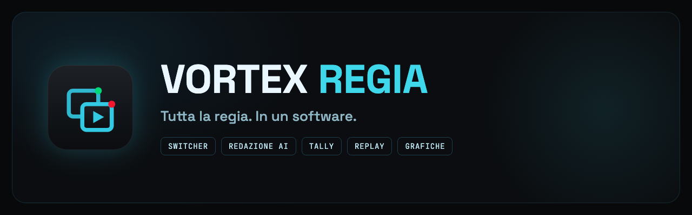
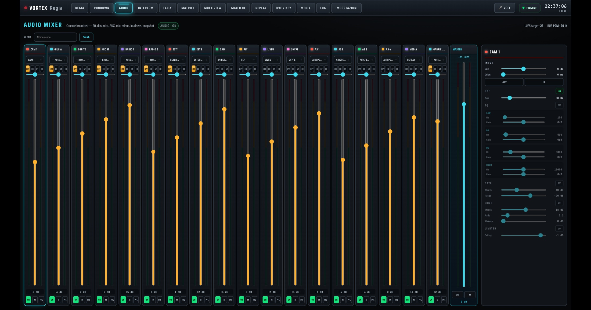
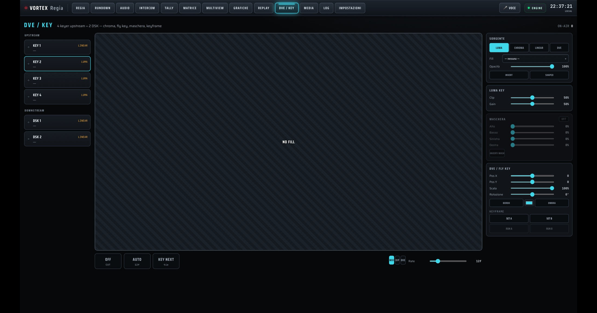
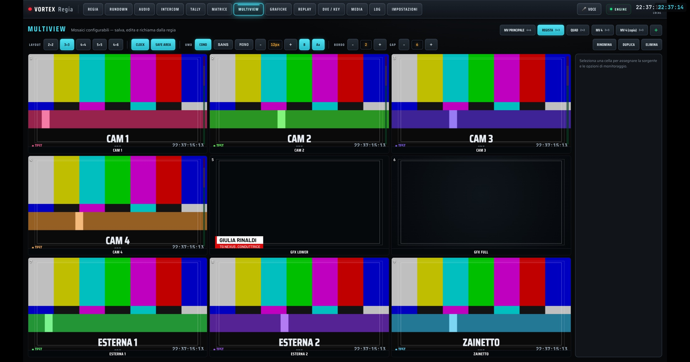
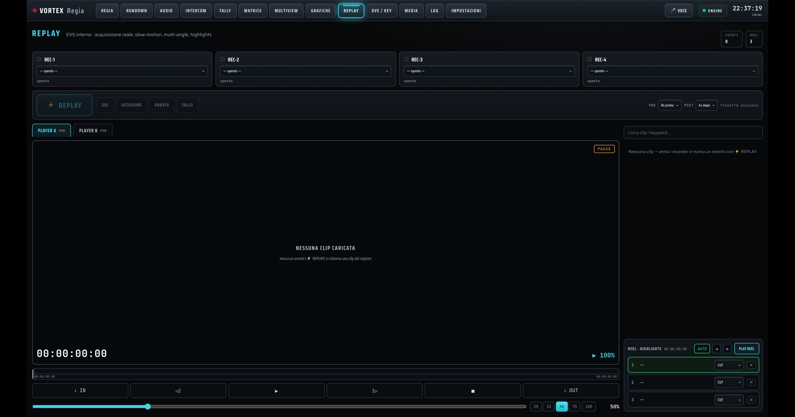
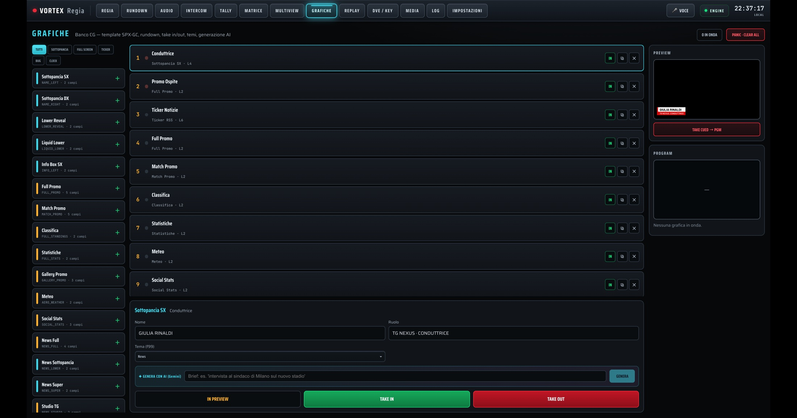
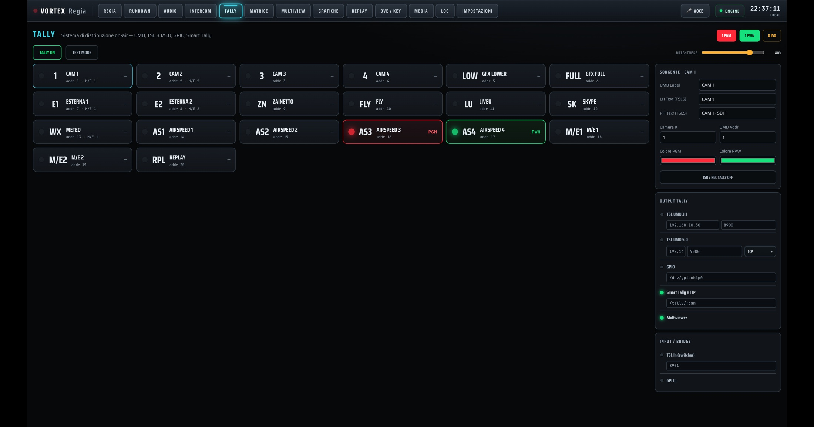
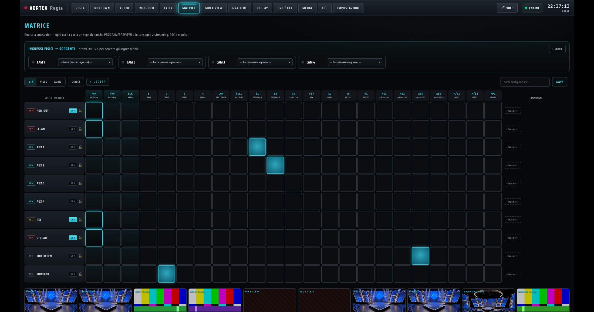
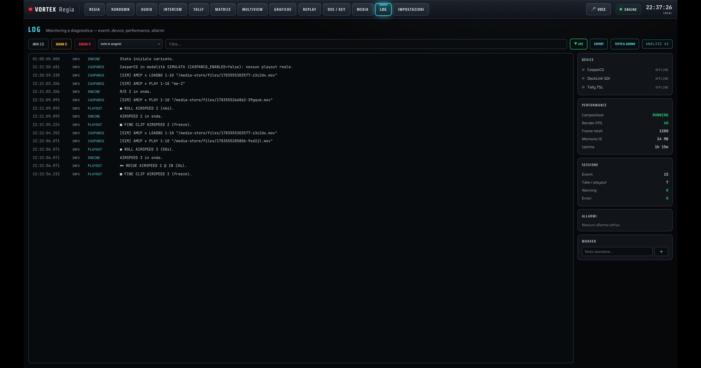

<a href="README.md">Italiano</a> · <strong>English</strong>

🌐 <a href="https://solarys431.github.io/vortex-control/">Landing page</a>

---

## What it is

VORTEX Regia is a **functional prototype** that combines switching, audio mixing, tally, replay, graphics and rundown management in a single software environment. It incorporates **NewsIntelligence**, an AI-powered news aggregator that gathers configured sources, evaluates stories and suggests the newscast rundown, plus a **voice-control layer** for issuing commands. Final decisions remain with the newsroom and control room.

The images **show the real product with demonstration data**.

---

## Main features

### NewsIntelligence — from story to rundown

NewsIntelligence gathers configured sources, evaluates stories and suggests the **newscast rundown**, including guidance for graphics and packages. AI suggests, the newsroom and control room decide.

### Voice control

The director speaks through a headset and the system interprets the commands. “AIRSPEED 2 on air”, “anchor lower” and “build the rundown from the news” are transcribed on screen and converted into actions controlled by the director.

### Broadcast audio

An 18-channel software console with HPF, parametric EQ, gate, compressor, limiter and pan. It includes per-output buses, N-1, master, snapshots and estimated LUFS-S monitoring. Voice and AI commands can also control audio parameters.

### Switcher, DVE and keyers

PGM/PVW buses, M/E, WIPE patterns, DVE and keyers. DVE, replay, clips and graphics are sources on the buses and are controlled from the same interface.

### Multiview, tally, replay and graphics

PVW/PGM monitoring, graphics preview and remote-guest multiview; TSL 3.1/5.0 tally support over UDP; replay from files and webcams; HTML graphics templates composited on PGM/PVW. DeckLink replay capture is still in development.

  
  

  
  

### Output matrix

PGM, CLEAN and AUX can be routed to playout, YouTube and REC as differentiated outputs, each with its own audio.

### Logs and diagnostics

System events for commands, playout, hardware, AI and voice are recorded by level and module, with filters and export tools that help reconstruct what happened and when.

---

## Architecture

The **client-server** architecture keeps mixer state on the server and includes control modules for CasparCG, DeckLink and tally. The GUI is the browser and desktop control surface. The critical path is designed not to depend on AI services, but hardware integrations and operational behavior still require field validation. Simulation mode is identified in the interface.

---

## Status

**Functional prototype, in development.** This repository and its landing page are public; the application source code is not included. The static site uses no cookies or tracking, and product screens use demonstration data.

© 2026 Daniele Cappello

